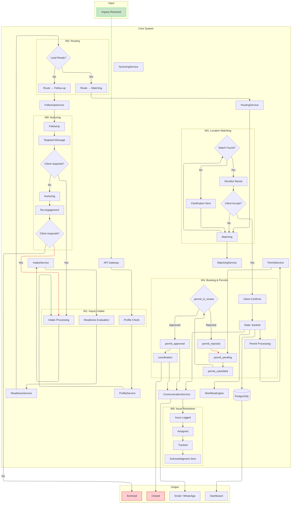
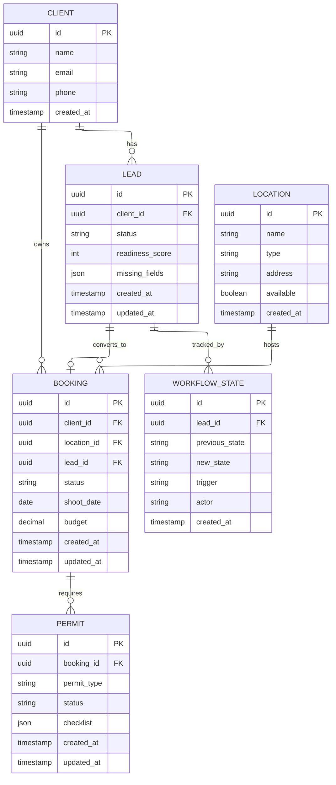

# LocationHQ — System Diagrams

---

## Diagram 1: High-Level System Flow

```mermaid
---
config:
  layout: elk
---
flowchart TB
 subgraph Input["Input"]
        F1["Inquiry Form"]
        F11["Partial Submission"]
  end
 subgraph subGraph1["Core System"]
        A1["IntakeService"]
        A2["ReadinessService"]
        C1["WorkflowEngine"]
        C2["RoutingService"]
        A3["MatchingService"]
        A4["PermitService"]
        C4["FollowUpService"]
        A6["NurturingService"]
        A5["CommunicationService"]
        C3["ProfileService"]
        API["API Gateway"]
  end
 subgraph Output["Output"]
        ClientDash["Client Dashboard"]
        InternalDash["Internal Dashboard"]
        Messages["Email / WhatsApp"]
  end
    Client(["Client"]) --> API
    API --> F1 & F11
    %% Full inquiry triggers intake pipeline (A1 → A2 → C2 → C1.transition)
    F1 --> A1

    %% Partial inquiry does NOT trigger A1/A2.
    %% It creates a lead in needs_info and stores missing_fields; follow-up is handled via C4 → A5.
    F11 --> C3

    %% Intake pipeline: services return results; ONLY C1 writes leads.status
    A1 --> A2
    A2 --> C2
    C2 --> C1

    %% Profile lookup/creation is synchronous during inquiry/partial submission
    C3 --> DB[("PostgreSQL")]

    %% Workflow orchestration + persistence
    C1 --> DB & A3 & C4 & A4 & A5
    C2 --> C1
    A3 --> C1
    A4 --> C1
    C4 --> A5
    A6 --> A5
    A5 --> Messages
    DB --> ClientDash & InternalDash
    Messages --> Client

    style Client fill:#C8E6C9,stroke:#00C853
    linkStyle 0 stroke:#00C853,fill:none
    linkStyle 23 stroke:#D50000
```

---

## Diagram 2: Workflow Flowchart W1–W9



---

## Diagram 3: Sequence Diagram

```mermaid
sequenceDiagram
    participant Client
    participant API as API Gateway
    participant A1 as A1 IntakeService
    participant C3 as C3 ProfileService
    participant A2 as A2 ReadinessService
    participant C2 as C2 RoutingService
    participant C1 as C1 WorkflowEngine
    participant A3 as A3 MatchingService
    participant A4 as A4 PermitService
    participant C4 as C4 FollowUpService
    participant A5 as A5 CommunicationService
    participant DB as PostgreSQL

    Client->>API: Submit inquiry form
    API->>C3: Lookup or create client profile (sync)
    C3->>DB: Read/write clients
    API->>DB: Create lead (status: new) and store intake_data (sync)
    API-->>Client: 202 Accepted (lead created; async processing queued)
    Note over API,C1: BackgroundTask runs after response
    API->>A1: run_intake_pipeline(lead_id) starts

    A1->>A2: Parse + pass structured data
    A2->>A2: Score completeness
    alt Lead is ready
        A2-->>C2: ReadinessResult(status=ready, score, missing_fields)
        C2-->>C1: Route decision (target_state=matching_in_progress)
        C1->>DB: C1.transition(...) writes lead.status + workflow_state
        C1->>A3: Trigger matching pipeline (async)
    else Lead is incomplete
        A2-->>C2: ReadinessResult(status=needs_info, missing_fields)
        C2-->>C1: Route decision (target_state=needs_info)
        C1->>DB: C1.transition(...) writes lead.status + workflow_state
        C1->>C4: Build follow-up context (rule-based)
        C4->>A5: Pass context for missing fields
        A5-->>Client: Send targeted message (async)
        Client->>API: Submit updated inquiry
        API->>DB: Merge updates into leads.intake_data (sync)
        API-->>Client: 202 Accepted (re-assessing async)
        API->>A1: run_intake_pipeline(lead_id) re-triggered
    end
    C1->>A3: Request location match

    A3->>DB: Query location inventory
    A3->>A3: Rank shortlist
    A3-->>C1: Return shortlist

    C1->>DB: Store shortlist
    C1->>DB: C1.transition(...) updates lead.status to matched + workflow_state
    C1->>A5: Trigger shortlist notification
    A5-->>Client: Send shortlist

    Client->>API: Confirm location selection
    API->>C1: Route confirmation
    C1->>DB: C1.transition(...) updates lead.status to booked + workflow_state
    C1->>A4: Request permit checklist

    A4->>A4: Infer permit requirements
    A4-->>C1: Return checklist
    C1->>DB: Store permit checklist
    C1->>A5: Trigger booking confirmation
    A5-->>Client: Send booking confirmation and permit info

    Note over C1,A4: Permit Lifecycle
    C1->>DB: status = permit_pending
    A4->>C1: Update permit_submitted
    C1->>DB: status = permit_submitted
    A4->>C1: Update permit_in_review
    C1->>DB: status = permit_in_review
    
    alt Permit Rejected
        A4->>C1: Update permit_rejected
        C1->>DB: status = permit_rejected
        C1->>DB: status = permit_pending
    else Permit Approved
        A4->>C1: Update permit_approved
        C1->>DB: status = permit_approved
    end

    C1->>DB: status = coordination
    C1->>A5: Notify coordination updates
    A5-->>Client: Coordination updates

    C1->>DB: status = closed
```

---

## Diagram 4: Lead State Machine

```mermaid
---
config:
  layout: elk
  theme: redux
---
stateDiagram-v2
    [*] --> new

    new --> needs_info: Readiness below threshold
    new --> ready: Readiness passes

    needs_info --> ready: Client provides missing fields
    needs_info --> inactive: No response after 7 days

    ready --> matching_in_progress: Matching starts
    matching_in_progress --> matched: Shortlist sent
    matching_in_progress --> needs_clarification: Poor match (1x max)
    matching_in_progress --> manual_review: Clarification exhausted
    needs_clarification --> matching_in_progress: Client clarifies (re-run)

    matched --> ready: Client rejects shortlist
    matched --> inactive: No response after 7 days
    matched --> booked: Client confirms location
    manual_review --> ready: Ops resolves; reset clarification_count

    booked --> permit_pending: Initiate permit process
    permit_pending --> permit_submitted: Submitted by ops
    permit_submitted --> permit_in_review: Under authority review
    permit_in_review --> permit_approved: Approved
    permit_in_review --> permit_rejected: Rejected by authority
    permit_rejected --> permit_pending: Correction & Resubmit

    permit_approved --> coordination: Shoot logistics
    coordination --> closed: Shoot completed

    inactive --> needs_info: Client reactivates
    inactive --> archived: No response after extended period

    archived --> [*]
    closed --> [*]
```



---

## Diagram 5: ER Diagram



---

## Diagram 6: Service Interaction Diagram

```mermaid
---
config:
  layout: elk
---
flowchart TB
 subgraph AI_Services["AI Services"]
        A1["A1: IntakeService"]
        A2["A2: ReadinessService"]
        A3["A3: MatchingService"]
        A4["A4: PermitService"]
        A5["A5: CommunicationService"]
        A6["A6: NurturingService"]
  end
 subgraph Core_Services["Core Services"]
        C1["C1: WorkflowEngine"]
        C2["C2: RoutingService"]
        C3["C3: ProfileService"]
        C4["C4: FollowUpService"]
        C5["C5: AnalyticsService"]
  end
    Client(["Client"]) --> API["API Gateway"]
    API --> C3
    C3 --> DB[("PostgreSQL")]

    %% Full inquiry pipeline: A1 → A2 → C2 → C1.transition (ONLY C1 writes lead.status)
    API --> A1
    A1 --> A2
    A2 --> C2
    C2 --> C1 & C4
    C1 --> DB & A3 & A4 & A5
    A3 --> DB & C1
    A4 --> DB & C1
    C4 --> A5
    A6 --> A5
    A5 --> Client
    DB --> C5 & ClientDash(["Client Dashboard"])
    C5 --> InternalDash(["Internal Dashboard"])

    style Client fill:#C8E6C9,stroke:#00C853
    linkStyle 0 stroke:#00C853,fill:none
    linkStyle 19 stroke:#D50000
    linkStyle 22 stroke:#D50000
```